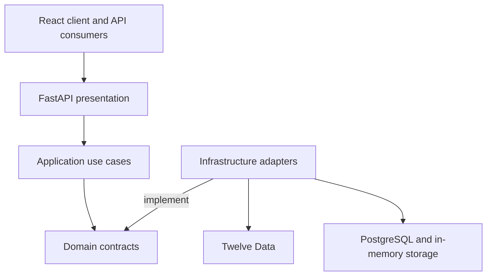

# NeuroFin AI Platform

NeuroFin is a financial forecasting MVP with a FastAPI backend and a React/TypeScript client. It brings together a REST API, interactive forecast visualization, external market data integration, and tested foundations for authentication and PostgreSQL persistence.

The current forecast method is a simple moving average (SMA). The architecture keeps data providers and forecasting methods behind contracts so they can evolve independently. Advanced model training and evaluation remain on the roadmap.

## MVP status

Current version: `v0.1.0-mvp`

Available today:

- FastAPI endpoints for health, forecasts from supplied historical values, and forecasts from daily market data.
- A React dashboard with health information and an interactive forecast page for supplied historical values. The market data endpoint is currently available through the API, not that page.
- A Twelve Data adapter for retrieving daily closing prices. The market data endpoint requires a local API key.
- Authentication and PostgreSQL persistence components with automated tests. These are foundations in the backend; a complete public authentication workflow is not exposed by the current API.
- Automated backend tests. The latest local run for GC-01 recorded `184 passed, 22 skipped, 1 warning` on September 25, 2026; results depend on the environment and which integration tests are enabled.

## Core stack

- Python 3.11+, FastAPI, Pydantic v2
- React, Vite, TypeScript
- SQLAlchemy 2 async, asyncpg, Alembic, PostgreSQL (local Compose setup)
- Argon2id and PS256 JWT components for authentication foundations
- HTTPX for the external market data adapter
- NumPy, Pandas, SciPy, scikit-learn, and joblib as available analysis and ML dependencies; the current forecast implementation is SMA
- pytest, Ruff, and mypy
- Clean Architecture boundaries across domain, application, infrastructure, and presentation

## Repository layout

```text
neurofin-ai-platform/
├── backend/
│   ├── app/
│   │   ├── application/
│   │   ├── core/
│   │   ├── domain/
│   │   ├── infrastructure/
│   │   ├── presentation/
│   │   └── main.py
│   ├── docs/
│   │   ├── adr/
│   │   ├── 00-vision.md
│   │   ├── 01-architecture.md
│   │   ├── 02-roadmap.md
│   │   ├── 03-domain-model.md
│   │   ├── 04-api-design.md
│   │   ├── 05-artificial-intelligence-strategy.md
│   │   ├── 06-azure-integration.md
│   │   └── 07-deployment.md
│   ├── tests/
│   ├── requirements.txt
│   ├── pyproject.toml
│   ├── .env.example
│   └── README.md
├── frontend/
│   ├── src/
│   └── README.md
├── infra/
│   └── postgres/
├── .gitignore
└── README.md
```

## Backend setup

Go to the backend directory:

```bash
cd backend
```

Create and activate a virtual environment on Windows CMD:

```bat
py -3.11 -m venv .venv
.venv\Scripts\activate.bat
```

Install dependencies:

```bash
python -m pip install -r requirements.txt
```

Copy `.env.example` to `.env` and set local values as needed. To use the market data endpoint, replace the placeholder with your own Twelve Data key:

```env
TWELVE_DATA_API_KEY=replace-with-your-own-key
```

Do not commit `.env` or a real API key. Without the key, the market data endpoint returns HTTP 503; health and forecasts from supplied values remain available.

Validate dependency consistency and run tests:

```bash
python -m pip check
python -m pytest
```

PostgreSQL integration tests require a configured disposable database and are skipped when that integration environment is not enabled.

## Run the API

From the `backend` directory:

```bash
uvicorn app.main:app --reload
```

Open Swagger UI at `http://127.0.0.1:8000/docs`.

## Available endpoints

```text
GET  /api/v1/health
POST /api/v1/forecast
POST /api/v1/forecast/market-data
```

Example `POST /api/v1/forecast` request with supplied historical values:

```json
{
  "symbol": "MSFT",
  "historical_values": [100.0, 101.2, 102.5, 103.3],
  "horizon": 3
}
```

Example response:

```json
{
  "symbol": "MSFT",
  "horizon": 3,
  "points": [
    { "step": 1, "value": 101.75 },
    { "step": 2, "value": 101.75 },
    { "step": 3, "value": 101.75 }
  ]
}
```

Example `POST /api/v1/forecast/market-data` request (requires `TWELVE_DATA_API_KEY`):

```json
{
  "symbol": "MSFT",
  "horizon": 2,
  "observations": 3
}
```

Illustrative response using SMA on closing prices returned by the provider; actual values depend on the retrieved series:

```json
{
  "symbol": "MSFT",
  "horizon": 2,
  "points": [
    { "step": 1, "value": 101.75 },
    { "step": 2, "value": 101.75 }
  ]
}
```

## Architecture approach

The backend separates responsibilities across four layers:

- `domain`: entities and contracts for forecasts, users, and market data.
- `application`: use cases that coordinate domain contracts.
- `infrastructure`: SMA forecasting, market data integration, and database adapters.
- `presentation`: FastAPI routes, schemas, and dependency wiring.



The market forecast use case depends on the `MarketDataProvider` contract and passes historical closing prices to `ForecastService`. `TwelveDataMarketDataProvider` handles provider-specific authentication, `/time_series` requests, response parsing, and error mapping. A different provider can be integrated through another adapter and dependency wiring without changing the forecasting domain model or use case. Requests sent through an adapter remain subject to that provider's availability, limits, and terms.

## Strategic roadmap

The next steps build on the current MVP:

- Complete the public authentication and session workflow around the existing security and persistence foundations.
- Connect the React client to the market data forecast endpoint and improve end-to-end demonstration flows.
- Train, evaluate, compare, and version forecasting models beyond the SMA baseline.
- Prepare deployment and operational documentation for a public demonstration.
- Explore SaaS capabilities, including tenant boundaries, only after the core workflows are validated.

## Documentation

Technical documentation is available in [`backend/docs/`](backend/docs/). Architecture decisions are recorded in [`backend/docs/adr/`](backend/docs/adr/).

## Notes

NeuroFin is under active development. Forecast outputs are illustrative and do not constitute financial advice.
